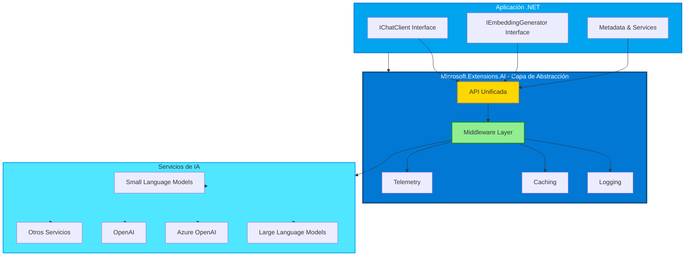
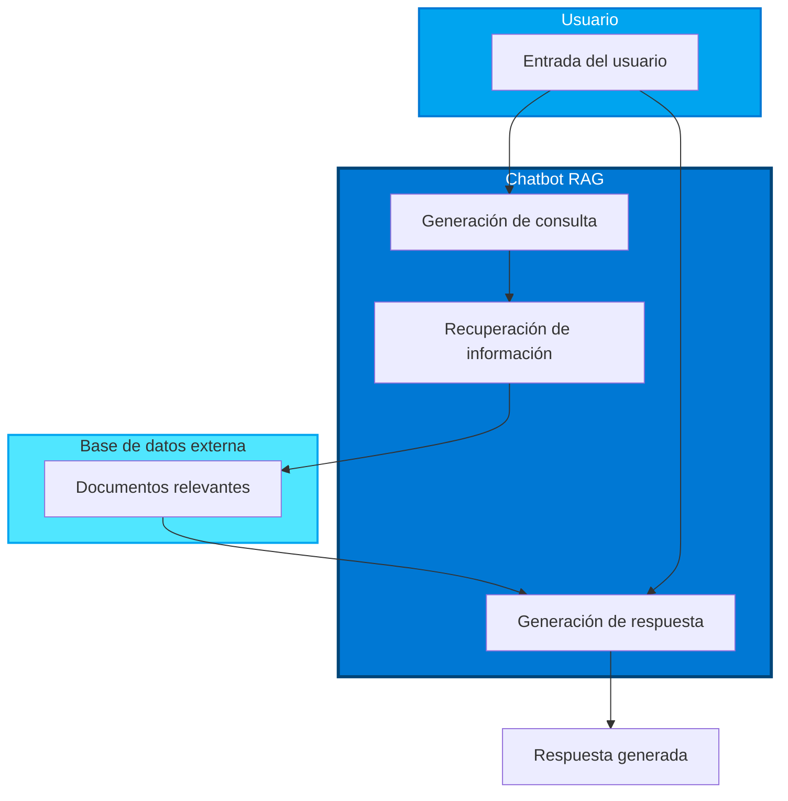

# Introducción a la IA Generativa

Tipo de inteligencia artificial que crea contenido nuevo, como texto, imágenes o código, basado en patrones y relaciones aprendidas de datos. Los modelos de IA generativa pueden generar respuestas similares a las humanas, entender el contexto e incluso, a veces, crear contenido que parece humano.

- **Generación de texto**: Crear texto similar al humano para chatbots, contenido y autocompletado.
- **Generación y análisis de imágenes**: Producir imágenes realistas, mejorar fotos y detectar objetos.
- **Generación de código**: Escribir fragmentos de código o scripts

Existen los SLMs, Small Language Models, utilizados para generación de texto sobre todo, y los LLMs, Larga Language Models, utilizados para generación de código o el análisis de imágenes.

## Ingeniería de Prompts

La ingeniería de prompts es el proceso de diseñar y optimizar las entradas (prompts) que se le dan a un modelo de IA generativa para obtener respuestas más precisas, relevantes o creativas. Un buen prompt puede mejorar significativamente la calidad de las respuestas generadas por el modelo.

- **Prompts de sistema**: Proporcionan instrucciones o contexto para guiar el comportamiento del modelo.
- **Prompts de usuario**: Son las preguntas o solicitudes que el usuario hace al modelo.
- **Prompts de asistente**: Son las respuestas generadas por el modelo en función de los prompts de sistema y usuario.

## Terminología

- **Token**: Unidad básica de texto que un modelo de IA procesa, como palabras o caracteres.
- **Embeddings**: Representaciones vectoriales de tokens que capturan su significado y relaciones, permitendo al modelo entender el contexto y generar respuestas coherentes.
- **Base de datos vectoriales**: Colección de embeddings que se pueden utilizar para comparar y analizar datos de texto. Permiten que los modelos generen respuestas basadas en el contexto de los datos de entrada.
- **Agentes**: componentes de IA que interactúan con los modelos para generar respuestas. Pueden ser chatbots, asistentes virtuales u otras aplicaciones que utilicen modelos de IA generativa para crear contenido.

## Herramientas y bibliotecas de desarrollo de IA para .NET

### Microsoft.Extensions.AI (MEAI)

Proporciona abstracciones unificadas y middleware para simplificar la integración de servicios de IA en aplicaciones .NET.

Al proporcionar una API consistente, MEAI permite a los desarrolladores interactuar con diferentes servicios de IA, como modelos de lenguaje pequeños y grandes, embeddings e incluso middleware a través de una interfaz común. Esto reduce la complejidad de construir una aplicación de IA en .NET, ya que desarrollarás contra la misma API para diferentes servicios.

Por ejemplo:

```csharp Interfaz de cliente de chat
// Interfaz que usaría para crear un cliente de chat con MEAI (independiente del servicio de IA)
public interface IChatClient : IDisposable
{
    Task<ChatCompletion> CompleteAsync(...);
    IAsyncEnumerable<StreamingChatCompletionUpdate> CompleteStreamingAsync(...);
    ChatClientMetadata Metadata { get; }
    TService? GetService<TService>(object? key = null) where TService : class;
}
```

De esta manera, al usar MEAI para construir una aplicación de chat, desarrollarás contra la misma superficie de API para obtener una respuesta de chat, transmitir la respuesta, obtener metadatos o acceder al servicio de IA subyacente. Esto facilita cambiar servicios de IA o agregar nuevos según sea necesario.

Además, la biblioteca admite componentes de middleware para funcionalidades como registro, almacenamiento en caché y telemetría, lo que facilita el desarrollo de aplicaciones de IA robustas.

#### Arquitectura de Microsoft.Extensions.AI



### Semantic Kernel (SK)

Semantic Kernel es un SDK de código abierto que permite a los desarrolladores integrar modelos de lenguaje de IA generativa en sus aplicaciones .NET. Proporciona abstracciones para servicios de IA y almacenes de memoria (vectores), permitiendo la creación de complementos que pueden ser orquestados automáticamente por IA. Incluso utiliza el estándar OpenAPI, lo que permite a los desarrolladores crear agentes de IA para interactuar con APIs externas.


Semantic Kernel admite .NET, así como otros lenguajes como Java y Python, ofreciendo una gran cantidad de conectores, funciones y complementos para la integración. Algunas de las características clave de Semantic Kernel incluyen:

Kernel Core: Proporciona la funcionalidad principal para Semantic Kernel, incluyendo conectores, funciones y complementos para interactuar con servicios y modelos de IA. Es el núcleo del sistema, disponible para servicios y complementos, supervisando agentes y actuando como middleware activo para tu aplicación.

Por ejemplo, puede elegir el mejor servicio de IA para una tarea específica, construir y enviar el prompt al servicio, y devolver la respuesta a la aplicación. A continuación, un diagrama del Kernel Core en acción:


- Conectores de servicios de IA: Proporciona una capa de abstracción para exponer servicios de IA a múltiples proveedores con una interfaz común y consistente. Ejemplos incluyen Chat Completion, Text to Image, Text to Speech y Audio to Text.

- Conectores de bases de datos vectoriales: Exponen almacenes de vectores a múltiples proveedores a través de una interfaz común, permitiendo a los desarrolladores trabajar con embeddings, vectores y otras representaciones de datos.

- Funciones y complementos: Ofrecen una gama de funciones y complementos para tareas comunes de IA, como procesamiento de funciones, diseño de prompts, búsqueda de texto y más.

- Diseño de prompts: Proporciona herramientas para la ingeniería de prompts, incluyendo diseño, pruebas y optimización de prompts para mejorar el rendimiento y la precisión de los modelos de IA.

- Filtros: Controles sobre cuándo y cómo se ejecutan las funciones para mejorar la seguridad y las prácticas de IA responsable.

## Técnicas principales de IA generativa

### Fundamentos de Aplicaciones de chatbots

Los chatbots son aplicaciones de IA generativa que interactúan con los usuarios a través de texto o voz, proporcionando respuestas y asistencia en tiempo real. Para construir un chatbot efectivo, es importante comprender los fundamentos de su diseño e implementación.

Una forma común de construir un chatbot es utilizando un modelo de lenguaje grande (LLM) para generar respuestas basadas en las entradas del usuario.

```csharp Chatbot básico con un LLM en .NET
var githubEndpoint = new Uri("https://models.github.ai/inference");
var githubToken = "your_github_token_here";
var modelName = "Phi-4-mini-instruct";
var uri = "http://localhost:11434";

// Using a model hosted on GitHub Models
IChatClient client = new ChatCompletionsClient(
        endpoint: new Uri("https://models.github.ai/inference"),
        new AzureKeyCredential(githubToken))
        .AsIChatClient(modelName);

// Using a local model
var localClient = new OllamaClient(uri, modelName).AsIChatClient();

// Here we're building the prompt
StringBuilder prompt = new StringBuilder();
prompt.AppendLine("You will analyze the sentiment of the following product reviews. Each line is its own review. Output the sentiment of each review in a bulleted list and then provide a generate sentiment of all reviews. ");
prompt.AppendLine("I bought this product and it's amazing. I love it!");
prompt.AppendLine("This product is terrible. I hate it.");
prompt.AppendLine("I'm not sure about this product. It's okay.");
prompt.AppendLine("I found this product based on the other reviews. It worked for a bit, and then it didn't.");

// Send the prompt to the model and wait for the text completion
var response = await client.GetResponseAsync(prompt.ToString());

// Display the response
Console.WriteLine(response.Text);
```

#### Function calling

Permite a los chatbots llamar a funciones o APIs externas para obtener información adicional o realizar acciones específicas. Esto puede mejorar la capacidad del chatbot para proporcionar respuestas precisas y relevantes.

```csharp Function calling example
using Azure.AI.Inference;
using Azure;
using Microsoft.Extensions.AI;
using Microsoft.Extensions.Configuration;
using System.ComponentModel;

var githubToken = Environment.GetEnvironmentVariable("GITHUB_TOKEN");
if (string.IsNullOrEmpty(githubToken))
{
    var config = new ConfigurationBuilder().AddUserSecrets<Program>().Build();
    githubToken = config["GITHUB_TOKEN"];
}

ChatOptions options = new ChatOptions
{
    Tools = [
        AIFunctionFactory.Create(GetTheWeather)
    ]
};


IChatClient client = new ChatCompletionsClient(
    endpoint: new Uri("https://models.github.ai/inference"),
    new AzureKeyCredential(githubToken))
    .AsIChatClient("gpt-4o-mini")
    .AsBuilder()
    .UseFunctionInvocation()
    .Build();

var question = "Do I need an umbrella today?";
Console.WriteLine($"question: {question}");
var response = await client.GetResponseAsync(question, options);
Console.WriteLine($"response: {response}");


[Description("Get the weather")]
static string GetTheWeather()
{
    var temperature = Random.Shared.Next(5, 20);
    var conditions = Random.Shared.Next(0, 1) == 0 ? "sunny" : "rainy";
    var weatherInfo = $"The weather is {temperature} degrees C and {conditions}.";
    Console.WriteLine($"\tFunction Call - Returning weather info: {weatherInfo}");
    return weatherInfo;
}
```

### Retrieval Augmented Generation (RAG)

RAG es una técnica que combina la generación de texto con la recuperación de información. En lugar de depender únicamente del conocimiento almacenado en el modelo, RAG permite a los chatbots recuperar información relevante de una base de datos o fuente externa para generar respuestas más precisas y actualizadas.

Hay 2 fases principales en RAG:

1. **Recuperación**: El chatbot utiliza un modelo de lenguaje para generar una consulta basada en la entrada del usuario. Esta consulta se utiliza para recuperar información relevante de una base de datos o fuente externa, como documentos, artículos o datos estructurados.

2. **Generación**: El chatbot utiliza la información recuperada junto con la entrada del usuario para generar una respuesta coherente y relevante. Esto permite al chatbot proporcionar respuestas más precisas y actualizadas, ya que puede acceder a información que no está almacenada en el modelo.



#### Embedings

En la fase de recupoeración de RAG, no se quiere recuperar toda la información de la base de datos, sino solo la información relevante para la consulta del usuario. Para esto se utilizan los embeddings, que son representaciones vectoriales de texto que capturan su significado y relaciones. Al convertir tanto la consulta del usuario como los documentos en la base de datos en embeddings, el chatbot puede comparar estos vectores para identificar qué documentos son más relevantes para la consulta y recuperarlos para la generación de la respuesta.

Se necesita comparar la consulta del usuario con la base de datos, de forma que se pueda recuperar la información relevante mínima para generar la respuesta.

#### Implementación de RAG en .NET

Para los ejemplos se utilizarán las librerías `Microsoft.Extensions.AI` junto con `Micrososft.Extensions. VectorData` y `Microsoft.SemanticKernel.Connectors.InMemory`

```csharp RAG implementation example
// Este ejemplo demuestra RAG completo (Retrieval Augmented Generation):
// 1. Recuperación: Buscar información relevante usando embeddings
// 2. Generación: Usar un LLM para generar una respuesta con el contexto recuperado

// POCO Class
public class Movie
{
    [VectorStoreKey]
    public int Key { get; set; }

    [VectorStoreData]
    public string Title { get; set; }

    [VectorStoreData]
    public string Description { get; set; }

    [VectorStoreVector(384, DistanceFunction.CosineSimilarity)]
    public ReadOnlyMemory<float> Vector { get; set; }
}

// Este ejemplo demuestra RAG (Retrieval Augmented Generation) usando GitHub Models para embeddings.
using Azure;
using Azure.AI.Inference;
using Microsoft.Extensions.AI;
using Microsoft.SemanticKernel.Connectors.InMemory;

// ====== FASE DE PREPARACIÓN: Configurar el almacén de vectores ======
// Crear un almacén de vectores en memoria para guardar los embeddings
// Los embeddings son representaciones numéricas que capturan el significado del texto
var vectorStore = new InMemoryVectorStore();

// Obtener la colección donde se almacenarán las películas con sus vectores
// Cada película tendrá un vector que representa su descripción
var movies = vectorStore.GetCollection<int, MovieVector<int>>("movies");
await movies.EnsureCollectionExistsAsync();
var movieData = MovieFactory<int>.GetMovieVectorList();

// ====== FASE DE GENERACIÓN DE EMBEDDINGS ======
// Configurar el generador de embeddings que convertirá texto en vectores numéricos
var githubToken = Environment.GetEnvironmentVariable("GITHUB_TOKEN")
    ?? throw new InvalidOperationException("Missing GITHUB_TOKEN environment variable. Set it to use GitHub Models.");

// El generador de embeddings transforma texto en vectores de números flotantes
// Textos con significados similares tendrán vectores similares
IEmbeddingGenerator<string, Embedding<float>> generator =
    new EmbeddingsClient(
        endpoint: new Uri("https://models.github.ai/inference"),
        new AzureKeyCredential(githubToken))
    .AsIEmbeddingGenerator("text-embedding-3-small");

// Generar embeddings para cada película y almacenarlos en la base de datos vectorial
// Esto es la fase de "indexación" - preparar los datos para búsquedas rápidas
foreach (var movie in movieData)
{
    // Convertir la descripción de la película en un vector numérico
    movie.Vector = await generator.GenerateVectorAsync(movie.Description);
    // Insertar o actualizar la película con su embedding en el almacén
    await movies.UpsertAsync(movie);
}

// ====== FASE DE RECUPERACIÓN (Retrieval) ======
// Esta es la primera fase de RAG: buscar información relevante
var query = "A family friendly movie that includes ogres and dragons";

// Convertir la consulta del usuario en un embedding usando el mismo generador
// Esto permite comparar la consulta con las películas almacenadas
var queryEmbedding = await generator.GenerateVectorAsync(query);

// Buscar en el almacén vectorial las películas más similares a la consulta
// La búsqueda compara el vector de la consulta con los vectores de las películas
// y devuelve las más cercanas (top: 2 = las 2 más relevantes)
var searchResults = movies.SearchAsync(queryEmbedding, top: 2);

// ====== FASE DE GENERACIÓN (Augmented Generation) ======
// Esta es la segunda fase de RAG: usar el contexto recuperado para generar una respuesta

// Configurar el cliente de chat que generará la respuesta final
IChatClient chatClient = new ChatCompletionsClient(
    endpoint: new Uri("https://models.github.ai/inference"),
    new AzureKeyCredential(githubToken))
    .AsIChatClient("gpt-4o-mini");

// Crear una conversación con un prompt del sistema que define el comportamiento del bot
List<ChatMessage> conversation = new()
{
    new ChatMessage(ChatRole.System,
        "Eres un asistente útil que recomienda películas. " +
        "Usa la información proporcionada sobre películas disponibles para responder a las preguntas del usuario.")
};

// Añadir la pregunta del usuario a la conversación
conversation.Add(new ChatMessage(ChatRole.User, query));

// Añadir el contexto recuperado a la conversación
// Cada resultado de búsqueda se añade como información adicional para el modelo
await foreach (var result in searchResults)
{
    conversation.Add(new ChatMessage(ChatRole.User,
        $"Esta película está disponible: {result.Record.Title} y trata sobre {result.Record.Description}"));

    // Mostrar información de los resultados recuperados
    Console.WriteLine($"[Recuperado] {result.Record.Title} (Score: {result.Score:F4})");
}

Console.WriteLine(); // Línea en blanco para separar

// Enviar toda la conversación (pregunta + contexto) al modelo de lenguaje
// El LLM generará una respuesta basada en la información recuperada
var response = await chatClient.CompleteAsync(conversation);

// Añadir la respuesta del asistente a la conversación (útil para múltiples turnos)
conversation.Add(new ChatMessage(ChatRole.Assistant, response.Message.Text));

// Mostrar la respuesta generada por el LLM
Console.WriteLine($"Bot:> {response.Message.Text}");

// RESULTADO: El bot habrá generado una respuesta personalizada usando el contexto
// de las películas recuperadas, en lugar de simplemente listar los resultados de búsqueda.
```
