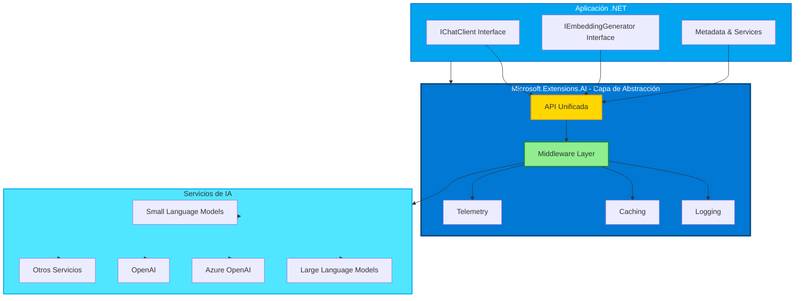

# Introducción a la IA Generativa

Tipo de inteligencia artificial que crea contenido nuevo, como texto, imágenes o código, basado en patrones y relaciones aprendidas de datos. Los modelos de IA generativa pueden generar respuestas similares a las humanas, entender el contexto e incluso, a veces, crear contenido que parece humano.

- **Generación de texto**: Crear texto similar al humano para chatbots, contenido y autocompletado.
- **Generación y análisis de imágenes**: Producir imágenes realistas, mejorar fotos y detectar objetos.
- **Generación de código**: Escribir fragmentos de código o scripts

Existen los SLMs, Small Language Models, utilizados para generación de texto sobre todo, y los LLMs, Larga Language Models, utilizados para generación de código o el análisis de imágenes.

## Ingeniería de Prompts

La ingeniería de prompts es el proceso de diseñar y optimizar las entradas (prompts) que se le dan a un modelo de IA generativa para obtener respuestas más precisas, relevantes o creativas. Un buen prompt puede mejorar significativamente la calidad de las respuestas generadas por el modelo.

- **Prompts de sistema**: Proporcionan instrucciones o contexto para guiar el comportamiento del modelo.
- **Prompts de usuario**: Son las preguntas o solicitudes que el usuario hace al modelo.
- **Prompts de asistente**: Son las respuestas generadas por el modelo en función de los prompts de sistema y usuario.

## Terminología

- **Token**: Unidad básica de texto que un modelo de IA procesa, como palabras o caracteres.
- **Embeddings**: Representaciones vectoriales de tokens que capturan su significado y relaciones, permitendo al modelo entender el contexto y generar respuestas coherentes.
- **Base de datos vectoriales**: Colección de embeddings que se pueden utilizar para comparar y analizar datos de texto. Permiten que los modelos generen respuestas basadas en el contexto de los datos de entrada.
- **Agentes**: componentes de IA que interactúan con los modelos para generar respuestas. Pueden ser chatbots, asistentes virtuales u otras aplicaciones que utilicen modelos de IA generativa para crear contenido.

## Herramientas y bibliotecas de desarrollo de IA para .NET

### Microsoft.Extensions.AI (MEAI)

Proporciona abstracciones unificadas y middleware para simplificar la integración de servicios de IA en aplicaciones .NET.

Al proporcionar una API consistente, MEAI permite a los desarrolladores interactuar con diferentes servicios de IA, como modelos de lenguaje pequeños y grandes, embeddings e incluso middleware a través de una interfaz común. Esto reduce la complejidad de construir una aplicación de IA en .NET, ya que desarrollarás contra la misma API para diferentes servicios.

Por ejemplo:

```csharp Interfaz de cliente de chat
// Interfaz que usaría para crear un cliente de chat con MEAI (independiente del servicio de IA)
public interface IChatClient : IDisposable
{
    Task<ChatCompletion> CompleteAsync(...);
    IAsyncEnumerable<StreamingChatCompletionUpdate> CompleteStreamingAsync(...);
    ChatClientMetadata Metadata { get; }
    TService? GetService<TService>(object? key = null) where TService : class;
}
```

De esta manera, al usar MEAI para construir una aplicación de chat, desarrollarás contra la misma superficie de API para obtener una respuesta de chat, transmitir la respuesta, obtener metadatos o acceder al servicio de IA subyacente. Esto facilita cambiar servicios de IA o agregar nuevos según sea necesario.

Además, la biblioteca admite componentes de middleware para funcionalidades como registro, almacenamiento en caché y telemetría, lo que facilita el desarrollo de aplicaciones de IA robustas.

#### Arquitectura de Microsoft.Extensions.AI



### Semantic Kernel (SK)

Semantic Kernel es un SDK de código abierto que permite a los desarrolladores integrar modelos de lenguaje de IA generativa en sus aplicaciones .NET. Proporciona abstracciones para servicios de IA y almacenes de memoria (vectores), permitiendo la creación de complementos que pueden ser orquestados automáticamente por IA. Incluso utiliza el estándar OpenAPI, lo que permite a los desarrolladores crear agentes de IA para interactuar con APIs externas.


Semantic Kernel admite .NET, así como otros lenguajes como Java y Python, ofreciendo una gran cantidad de conectores, funciones y complementos para la integración. Algunas de las características clave de Semantic Kernel incluyen:

Kernel Core: Proporciona la funcionalidad principal para Semantic Kernel, incluyendo conectores, funciones y complementos para interactuar con servicios y modelos de IA. Es el núcleo del sistema, disponible para servicios y complementos, supervisando agentes y actuando como middleware activo para tu aplicación.

Por ejemplo, puede elegir el mejor servicio de IA para una tarea específica, construir y enviar el prompt al servicio, y devolver la respuesta a la aplicación. A continuación, un diagrama del Kernel Core en acción:


- Conectores de servicios de IA: Proporciona una capa de abstracción para exponer servicios de IA a múltiples proveedores con una interfaz común y consistente. Ejemplos incluyen Chat Completion, Text to Image, Text to Speech y Audio to Text.

- Conectores de bases de datos vectoriales: Exponen almacenes de vectores a múltiples proveedores a través de una interfaz común, permitiendo a los desarrolladores trabajar con embeddings, vectores y otras representaciones de datos.

- Funciones y complementos: Ofrecen una gama de funciones y complementos para tareas comunes de IA, como procesamiento de funciones, diseño de prompts, búsqueda de texto y más.

- Diseño de prompts: Proporciona herramientas para la ingeniería de prompts, incluyendo diseño, pruebas y optimización de prompts para mejorar el rendimiento y la precisión de los modelos de IA.

- Filtros: Controles sobre cuándo y cómo se ejecutan las funciones para mejorar la seguridad y las prácticas de IA responsable.
